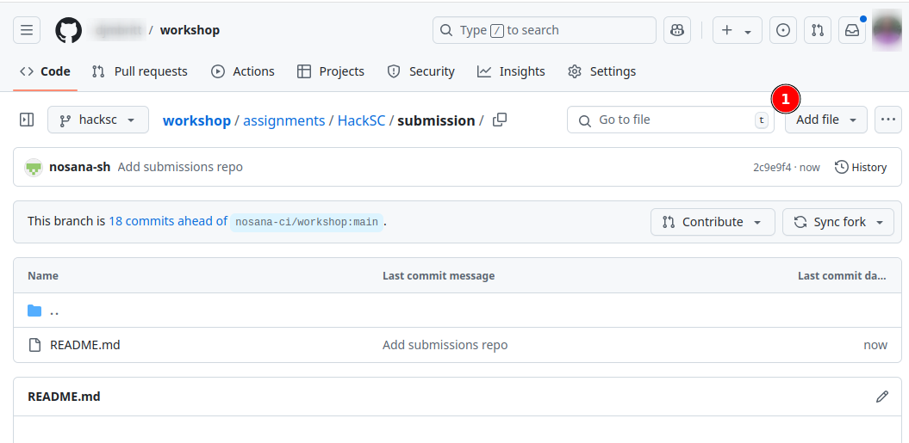
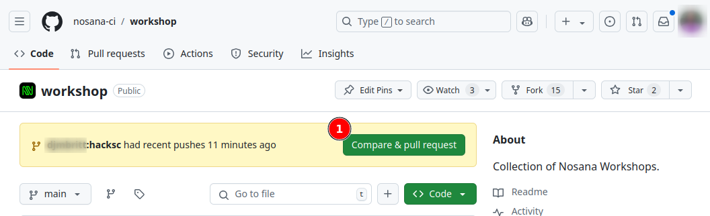
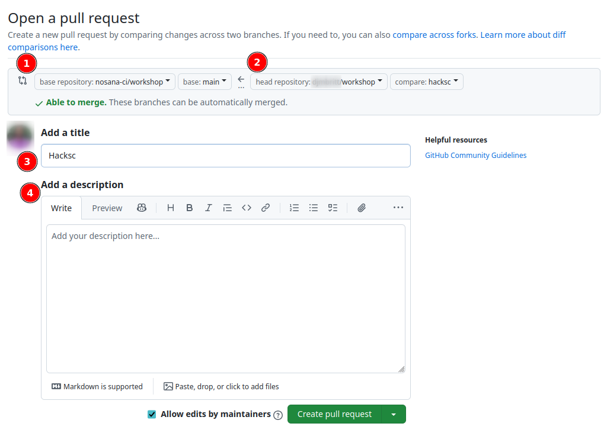

# Submission

<!-- TODO -->
<!-- We still need to make sure to document the steps of commiting the jupyter notebook file -->

Here you will find details on how to submit your project for the HackSC hackathon.

## Required Submission Components

Clearly outline what each team must include in their submission:

   - [ ] Code Repository: Include all source files and a clear README.
   - [ ] Demo: A working demo, hosted if possible (e.g., Streamlit, Hugging Face, or a website link).
   - [ ] Video Presentation: A short (1-2 min) video explaining the project, the problem solved, and a demo of the solution.
   - [ ] Documentation: Describe the technical implementation, challenges faced, and future improvements.
   - [ ] Jupyter Notebook (for AI/ML projects): Ensure it runs independently, contains annotations, and shows results.

- Ensure your pull request reflects your team name and project.
- Check that the `README.md` file in the `HackSC` folder contains:
  - Project name.
  - Team members.
  - Instructions for running the code.

## Submission Deadline

<!-- TODO -->

### **Hackathon Submission Plan**

## **1. Forking the Repository**

All students will be begin by forking the repository.
Go to [github.com/nosana-ci/workshop](https://github.com/nosana-ci/workshop) to `Fork` the repository to your GitHub account.

## **2. Download the Jupyter Notebook**

When you are ready to hand in your work, please download your Jupyter Notebook, the `nosana_workshop.ipynb` file.

## **3. Submitting, by Pull Request**

When handing in your project, you will need to include:
- `nosana_workshop.ipynb` notebook file that you downloaded.
- Updated [README.md](./submission/README.md) in the `submission/` folder about how the work you have done.

You can upload the `nosana_workshop.ipynb` file via the GitHub interface.

## 4. **Create a Pull Request:**

Submit a pull request to the main repository:
- Title: `[Team Name] Full Repository Submission`
- Description:
   - Team name and members.

This can be done via the GitHub interface, go to the main [Nosana workshop repo](https://github.com/nosana-ci/workshop/).
There should be a `Compare & pull request` button.

Afterwards we need to double check that we are indeed trying to merge with the correct repo ([Nosana workshop repo](https://github.com/nosana-ci/workshop/)).
We also need to make sure we are trying to merge the correct branches!
Don't forget to add a tittle and a description, and hit `Create pull request`.

 

---

### **Post-Submission Verification**
- Ensure your pull request reflects your team name and project.
- Check that the `README.md` file in the `HackSC` folder contains:
  - Project name.
  - Team members.
  - Instructions for running the code.
  - What problem are you trying to solve
  - How did you utilize what you learned during this hackathon in a creative way?
  - What were the major challenges in completing this track?
  - What was a highlight during this track?

