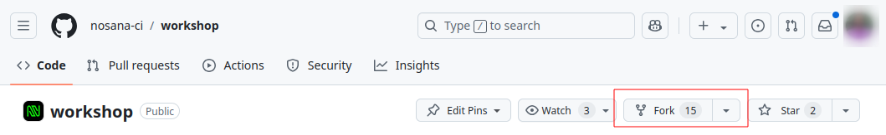
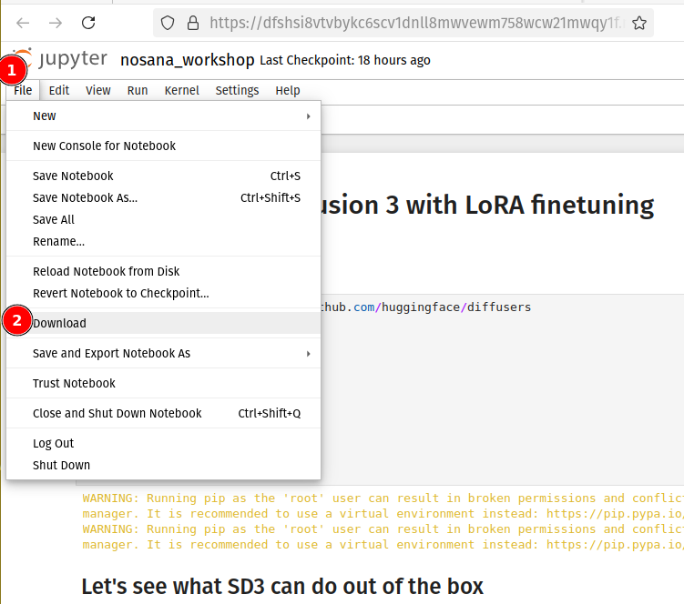

# Submission


<!-- TODO -->
<!-- We still need to make sure to document the steps of commiting the jupyter notebook file -->

Here you will find details on how to submit your project for the HackSC hackathon.

## Required Submission Components

Clearly outline what each team must include in their submission:

   - [ ] Code Repository: Include all source files and a clear README.
   - [ ] Demo: A working demo, hosted if possible (e.g., Streamlit, Hugging Face, or a website link).
   - [ ] Video Presentation: A short (1-2 min) video explaining the project, the problem solved, and a demo of the solution.
   - [ ] Documentation: Describe the technical implementation, challenges faced, and future improvements.
   - [ ] Jupyter Notebook (for AI/ML projects): Ensure it runs independently, contains annotations, and shows results.

- Ensure your pull request reflects your team name and project.
- Check that the `README.md` file in the `HackSC` folder contains:
  - Project name.
  - Team members.
  - Instructions for running the code.

## Submission Deadline


### **Hackathon Submission Plan**

## **1. Forking the Repository**

All students will be begin by forking the repository.
Go to [github.com/nosana-ci/workshop](https://github.com/nosana-ci/workshop) to `Fork` the repository to your GitHub account.



## **2. Download the Jupyter Notebook**

When you are ready to hand in your work, please download your Jupyter Notebook, the `nosana_workshop.ipynb` file.




#### **2. Submitting, by Pull Request**

Students will submit the entire repo.

1. **Work in the `HackSC` Folder:**
   - Make all necessary changes within the `assignments/HackSC/` folder.
   - Update the `README.md` file inside `HackSC` to reflect your work.

2. **Stage All Changes:**
   If you want to submit the entire repository, stage all changes:
   ```bash
   git add .
   ```

3. **Commit the Changes:**
   Commit the changes with a clear message:
   ```bash
   git commit -m "[Team Name] Hackathon Submission"
   ```

4. **Push the Changes:**
   Create a new branch for submission:
   ```bash
   git checkout -b team-name-submission
   git push origin team-name-submission
   ```

5. **Create a Pull Request:**
   Submit a pull request to the main repository:
   - Title: `[Team Name] Full Repository Submission`
   - Description:
     - Team name and members.
     - Mention that the submission includes the entire repository, with the primary work in the `HackSC` folder.

---

### **Best Practices for Students**
- **Commit Frequently:**
  Commit progress regularly to track changes and avoid losing work.
- **Focus on the `HackSC` Folder:**
  Even when submitting the entire repository, make it clear that your primary work is in the `HackSC` folder.
- **Use a `.gitignore` File (Optional):**
  Add a `.gitignore` file to avoid uploading unnecessary files (e.g., large datasets or temporary files).

---

### **Post-Submission Verification**
- Ensure your pull request reflects your team name and project.
- Check that the `README.md` file in the `HackSC` folder contains:
  - Project name.
  - Team members.
  - Instructions for running the code.

---

Would you like help creating a pre-configured `.gitignore` file or a `README.md` template for students?
